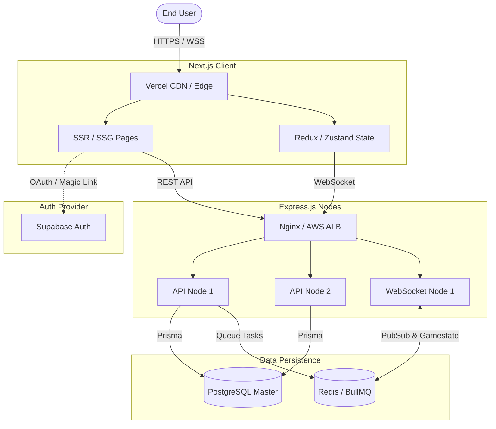

# System Architecture & Design

This document outlines the high-level architecture, system design decisions, and data flows of the EduScale platform.

## 1. High-Level Architecture Overview

EduScale is built on a loosely coupled, scalable architecture using the **Jamstack** philosophy combined with a powerful container-ready Node.js/Express backend. 

### Core Components
1. **Presentation Layer (Frontend):** 
   - Built with **Next.js 15 (App Router)** and **React 19**.
   - Hosted on Vercel for Edge Caching and CDN delivery.
   - Communicates with the Backend via RESTful HTTP JSON APIs and WebSockets.
2. **Business Logic Layer (Backend):**
   - Built with **Node.js** and **Express.js** using TypeScript.
   - Deployed as stateless micro-services (or a scalable monolith).
   - Serves API routes and integrates with Redis for session/cache.
3. **Real-time Engine:**
   - Powered by **Socket.io**.
   - Handles low-latency state synchronization for the *Battle Zone* and *Live Chat*.
   - Uses **Redis Pub/Sub** to emit events across multiple containerized socket instances.
4. **Data Layer:**
   - Relational Database: **PostgreSQL** (Managed by Prisma ORM).
   - Object Storage: **Cloudinary** for profile images, thumbnails, and media assets.

---

## 2. Infrastructure Diagram

## 3. Key Architectural Decisions (ADRs)

### 3.1. Why Next.js?
Next.js was selected to provide aggressive Server-Side Rendering (SSR) for robust SEO (important for public roadmaps, forums, and articles) while maintaining a highly interactive React context for the authenticated dashboard experiences and the code editor.

### 3.2. Why Prisma + PostgreSQL?
The platform has highly relational data: Users belong to Study Groups, Users complete Roadmap Topics, Users participate in Battles. Prisma enforces strict typings directly derived from the database schema, significantly reducing runtime errors.

### 3.3. Why Redis & BullMQ?
1. **Rate Limiting:** Protects `/api/auth` and `/api/battles` from brute-force/DDoS attacks.
2. **Socket Scalability:** Using Redis Adapter ensures that if User A is on WS Node 1, and User B is on WS Node 2, they both receive Battle State events simultaneously without dropping packets.
3. **Background Jobs:** Heavy tasks (cert generation, email parsing, challenge scoring) are offloaded to BullMQ workers instead of blocking the main thread.

---

## 4. Scalability & Deployment Strategy

EduScale is designed to scale horizontally across multiple instances:
- **Stateless Backend:** No session IDs are stored in memory. We use short-lived JWTs mapped to database roles. Therefore, any Express instance can successfully serve any incoming request.
- **Database Connection Pooling:** PgBouncer (or Prisma Accelerate) is utilized to manage connection limits between the serverless/edge environments and the PostgreSQL instance.
- **Edge Delivery:** Static assets (images, CSS, JS bundles) and cached JSON responses are pushed strictly to Edge/CDN nodes to guarantee sub-50ms TTFB (Time To First Byte) globally.
